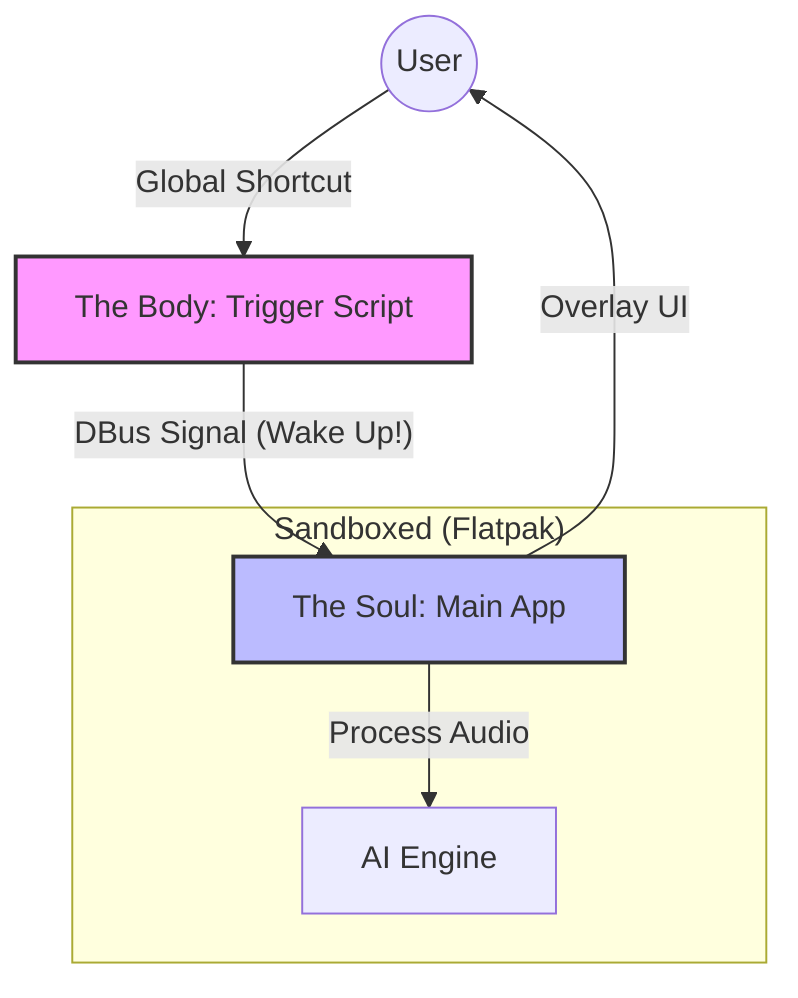
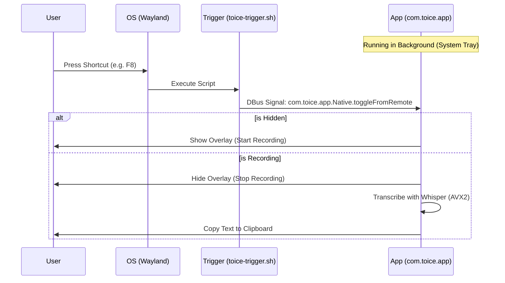

# Toice - Two Bodies, One Soul 🎙️


-orange?style=for-the-badge)

> [!WARNING]
> **Beta Release**: Toice is currently in active development. While creating the "Two Body" architecture, bugs may appear. Please report issues! 🐛

**Toice** is a minimalist, high-performance voice recorder and transcription tool for Linux, powered by local AI. It is built with **C++17**, **Qt6**, and **whisper.cpp**, designed to be invisible until you need it.

<p align="center">
  
</p>

## 🧘 The Philosophy: "Two Bodies, One Soul"

Toice is architected to respect the strict security models of modern Linux desktops (Wayland). It consists of two parts that work in unison:



1.  **The Soul (The App)**: The main application (`com.toice.app`). It handles the heavy lifting—recording, AI processing, and UI overlay. It runs quietly in the background.
2.  **The Body (The Trigger)**: A lightweight signal sender (`toice-trigger.sh`). It lives outside the sandbox and "pokes" the soul to wake up.

**Why?**
Modern compositors (Wayland) prevents apps from "listening" to your keyboard globally for security. To get around this without hacks, Toice relies on **you** (the OS owner) to set the shortcut. You bind the *Trigger* to a key, and the *Trigger* wakes the *Soul*.

---

## ⚡ Requirements

-   **OS**: Linux (Fedora Workstation / Silverblue, Ubuntu, Arch, etc.)
-   **Desktop**: GNOME 40+ or KDE Plasma 6 (Optimized for Wayland)
-   **Runtime**: Flatpak (freedesktop/KDE SDK 6.6)
-   **Hardware**: 
    -   CPU with AVX2/FMA support (Modern Intel/AMD) is highly recommended for real-time performance.
    -   4GB+ RAM.

---

## 📥 Installation

### 🚀 Quick Start (Easiest)

Run this in your terminal to install the latest Beta:

```bash
wget https://raw.githubusercontent.com/harshsharma2455/Toice/main/install.sh
chmod +x install.sh && ./install.sh
```

*The script will automatically download the app, install it, and guide you through the shortcut setup.*

### 📦 Manual Install (Flatpak)

If you have the `toice.flatpak` bundle:

```bash
# 1. Install the bundle
flatpak install --user toice.flatpak

# 2. Run it once to generate config
flatpak run com.toice.app
```

### 2. Build From Source

```bash
# Requirements: cmake, ninja, flatpak-builder
git clone https://github.com/yourusername/toice.git
cd toice

# Build & Install
flatpak-builder --user --install --force-clean build_folder flatpak/com.toice.app.yml
```

---

## 🔗 The Critical Step: Connecting Body & Soul

**You MUST set a global shortcut for the toggle to work.** Toice cannot "listen" to your keyboard securely without your permission.

### Method 1: The "Toice Toggle" App (Recommended)

1.  Open your System Settings -> **Shortcuts** (or Keyboard).
2.  Add a new shortcut.
3.  Search for **"Toice Toggle"** in your application list.
4.  Bind it to your desired key (e.g., `F8` or `Super+Alt+R`).

*This works reliably on both KDE Plasma and GNOME as we register a helper application specifically for this purpose.*

### Method 2: Manual Command (Advanced)

If you prefer custom commands:
```bash
flatpak run --command=toice-trigger.sh com.toice.app
```

---

## 🛠️ How It Works (Technical)



-   **Main App**: Launches and registers a DBus service `com.toice.app`. It sits in the system tray.
-   **Overlay**: When triggered, it creates a transparent, click-through overlay using `Qt::WindowTransparentForInput` and `Qt::WindowStaysOnTopHint`.
-   **Whisper**: Uses `whisper.cpp` (C++ port of OpenAI's Whisper) running the `base.en` model (quantized) for CPU inference. It achieves ~0.2x RTF (Real Time Factor) on modern CPUs.
-   **Trigger**: The `toice-trigger.sh` script sends a `dbus-send` command to the `com.toice.app.Native.toggleFromRemote` method.

## 📂 Project Structure

```
├── src/                # C++ Source Code (Qt6)
│   ├── main.cpp        # Entry point & DBus registration
│   ├── mainwindow.cpp  # UI & Tray Logic
│   └── setupwizard.h   # First-run Model Setup (Bundled)
├── flatpak/            # Build Manifests
│   └── com.toice.app.yml
├── assets/             # SVGs, Icons, and Models
└── scripts/            # Helper scripts (Trigger logic)
```

---

**Created with ❤️ for the Linux Desktop.**
